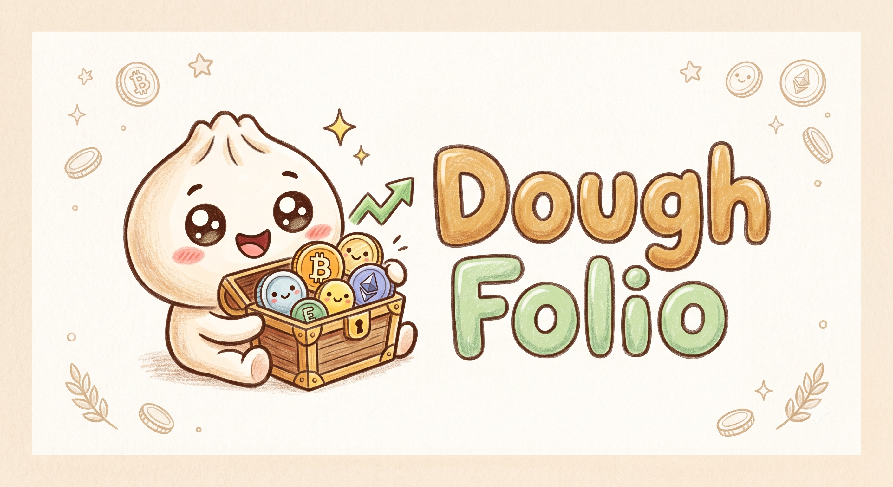

<p align="center">
  
</p>

<h1 align="center">DoughFolio 🥟</h1>

<p align="center">
  A cute, self-hosted, open-source cryptocurrency portfolio tracker.<br/>
  Built with <a href="https://bun.com">Bun</a> — because our mascot is a bun.
</p>

---

> **Status: early development.** The project is being scaffolded; features listed
> below are planned, not implemented yet. See [docs/PLANNING.md](docs/PLANNING.md)
> for pending design decisions.

## Planned features

- 📊 Track your crypto portfolio across wallets and exchanges
- 🧮 Manual transaction entry with cost-basis & P/L calculation
- 📈 Pretty charts with live market prices
- 🏠 Fully self-hosted — your data never leaves your server
- 🥟 A delightful, kawaii dumpling-themed UI

## Self-hosting with Docker

```sh
docker compose up -d      # uses ghcr.io/thevidko/doughfolio:latest
```

Your data lives in the `doughfolio-data` volume — back that up. The `:edge` tag
tracks the development branch if you want to live dangerously. 🥟

## Development quick start

Requires [Bun](https://bun.com) ≥ 1.3.

```sh
bun install
bun run dev      # development server with HMR → http://localhost:3000
```

Other scripts:

```sh
bun test           # run tests
bun run check      # typecheck + lint + tests
bun start          # production mode
```

## Tech stack

- **Runtime & tooling:** Bun (server, bundler, test runner, package manager)
- **Language:** TypeScript (strict)
- **Backend:** `Bun.serve` typed routes
- **Frontend:** React 19 + Tailwind CSS 4
- **Lint/format:** Biome

## Contributing

See [CLAUDE.md](CLAUDE.md) for code style, project structure, and development
conventions — they apply to humans and AI agents alike.

## License

[AGPL-3.0](LICENSE) — you are free to use, modify, and self-host DoughFolio;
if you run a modified version as a service, you must share your changes.
